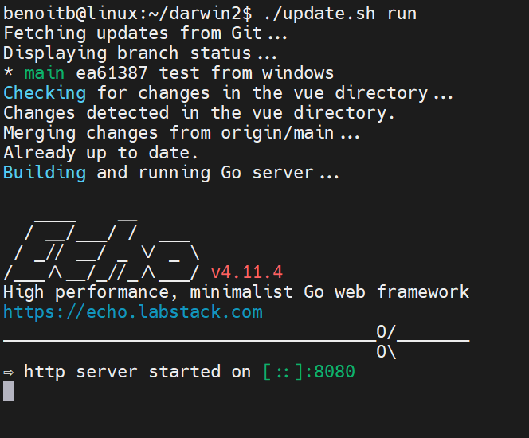
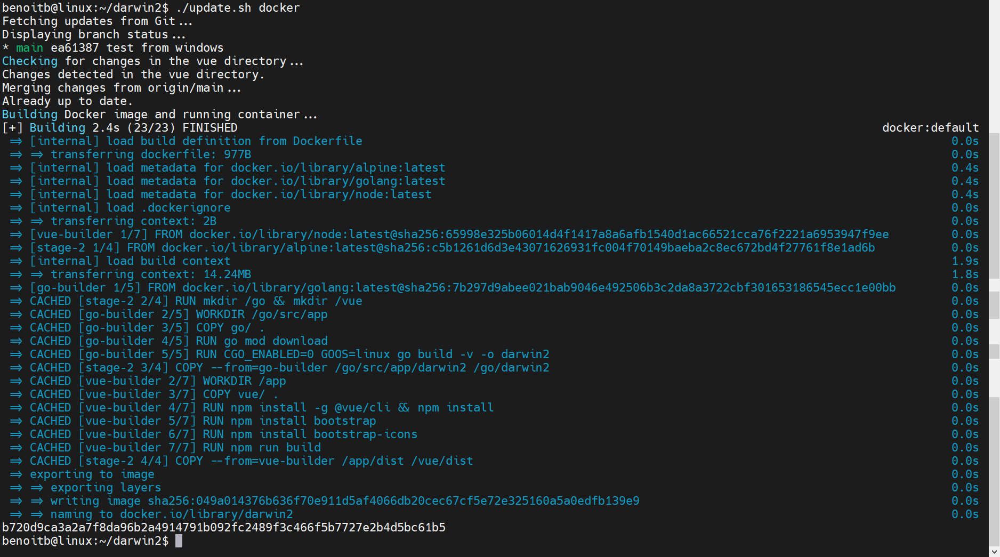

# Darwin2: A FortiWeb Demo Tool


Darwin2 is a demonstration tool designed to showcase the capabilities of FortiWeb and FortiWeb Cloud through a user-friendly graphical interface. This tool facilitates demonstrations of web protection, bot mitigation, API protection, Machine Learning, and the use of REST APIs for managing web applications.

## Features

### Web Protection

- **Web Vulnerability Scanner**: Simulate OWASP TOP 10 attacks and demonstrate FortiWeb's blocking techniques.
- **Traffic Generation**: Generate random cyber attacks from various IPs to populate FortiWeb logs and FortiView dashboards.
- **Web Attacks**: Generate specific attacks to demonstrate "user track" with usernames in attack logs.
- **Machine Learning & Zero-Day Attacks**: Simulate legitimate traffic to train FortiWeb's ML model and block zero-day attacks, showcasing ML logs.
- **Cookie Security**: Manipulate cookies to attempt privilege escalation on an application and demonstrate blocking.
- **Credential Stuffing Defense**: Use stolen account credentials to demonstrate blocking capabilities with our reputation database.

### Bot Mitigation

- **Known Bots**: Protect against malicious bots without affecting critical traffic flow.
- **Biometrics-Based Detection**: Determine human or bot origin of requests through client events like mouse movement and keyboard activity.
- **Bot Deception**: Configure bot deception policies to trap malicious bots.
- **Threshold-Based Detection**: Judge requests as human or bot based on suspicious behaviors.
- **Machine Learning Based Bot Detection**: Use web scraping to extract data and train ML models for bot detection.

### API Protection

- **API Requests**: Leverage Petstore3 for legitimate or malicious API requests to demonstrate FortiWeb capabilities.
- **API Traffic Generation**: Simulate traffic to build ML models and demonstrate zero-day attack protection.

### REST API

Quickly onboard and decommission applications with primary API tasks, verifying application accessibility.

## Installation Guide

Darwin2 leverages the GOLANG and VUEJS frameworks. To facilitate its implementation, the `update.sh` utility script can be used.

### Usage of `update.sh`

```plaintext
Usage: update.sh {run|docker|update}
```

### Option 1: Installation on Linux

#### Prerequisites

Before proceeding with the installation, ensure the following prerequisites are met:

```bash
# Update your package lists
sudo apt update

# Install Nikto
sudo apt install nikto -y

# Install Go
wget https://go.dev/dl/go1.22.0.linux-amd64.tar.gz
sudo rm -rf /usr/local/go && sudo tar -C /usr/local -xzf go1.22.0.linux-amd64.tar.gz
export PATH=$PATH:/usr/local/go/bin
go version

# Install Nodejs
curl -fsSL https://deb.nodesource.com/gpgkey/nodesource-repo.gpg.key | sudo gpg --dearmor -o /etc/apt/keyrings/nodesource.gpg
echo "deb [signed-by=/etc/apt/keyrings/nodesource.gpg] https://deb.nodesource.com/node_20.x nodistro main" | sudo tee /etc/apt/sources.list.d/nodesource.list
sudo apt-get update && sudo apt-get install nodejs -y
node -v

# Install npm
sudo npm install -g npm@latest

# Install Bootstrap and Bootstrap Icons
npm install bootstrap
npm install bootstrap-icons

# Download & Prepare the Darwin2 environment
git clone https://github.com/benoitbMTL/darwin2.git
cd darwin2
npm install @vue/cli
npm install
```

#### Running Darwin2 on Linux

Follow these steps run Darwin2:

```bash
./update.sh run
```



### Option 2: Installation with Docker

#### Prerequisites for Docker

Ensure Docker is installed on your system. Follow a quick installation guide for Docker and verify its installation:

Below is a code block detailing the steps to install Docker on Ubuntu. This guide assumes you're using a recent version of Ubuntu. 

```bash
# Update existing list of packages
sudo apt update

# Install prerequisite packages which let apt use packages over HTTPS
sudo apt install apt-transport-https ca-certificates curl software-properties-common -y

# Add the GPG key for the official Docker repository to your system
curl -fsSL https://download.docker.com/linux/ubuntu/gpg | sudo gpg --dearmor -o /usr/share/keyrings/docker-archive-keyring.gpg

# Add the Docker repository to APT sources
echo "deb [arch=$(dpkg --print-architecture) signed-by=/usr/share/keyrings/docker-archive-keyring.gpg] https://download.docker.com/linux/ubuntu $(lsb_release -cs) stable" | sudo tee /etc/apt/sources.list.d/docker.list > /dev/null

# Update the package database with Docker packages from the newly added repo
sudo apt update

# Make sure you are about to install from the Docker repo instead of the default Ubuntu repo
apt-cache policy docker-ce

# Finally, install Docker
sudo apt install docker-ce -y

# Docker should now be installed, the daemon started, and the process enabled to start on boot
# Check that it's running
sudo systemctl status docker

# Executing the Docker command without sudo (Optional)
# Add your username to the docker group
sudo usermod -aG docker ${USER}

# Apply the new group membership (You may need to logout & login again to apply the changes properly)
su - ${USER}

# Confirm that your user is added to the docker group
id -nG
```

This script includes the installation of Docker on Ubuntu, setting up the Docker repository, installing Docker CE (Community Edition), and ensuring Docker starts on boot. The optional step at the end allows you to run Docker commands without prefixing them with `sudo`.

#### Running Darwin2 with Docker

To install and run Darwin2 using Docker, execute the following:

```bash
git clone https://github.com/benoitbMTL/darwin2.git
cd darwin2
./update.sh docker
```


```
