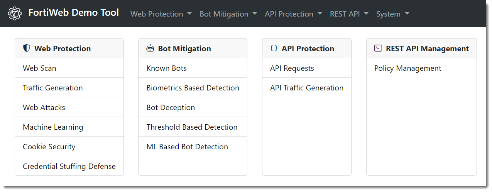

# Darwin2: A FortiWeb Demo Tool 🚀

Darwin2 is a demonstration tool designed to showcase the capabilities of FortiWeb and FortiWeb Cloud through a user-friendly graphical interface.



- [Darwin2: A FortiWeb Demo Tool 🚀](#darwin2-a-fortiweb-demo-tool-)
  - [Features](#features)
    - [Web Protection 🛡](#web-protection-)
    - [Bot Mitigation 🤖](#bot-mitigation-)
    - [API Protection 🔐](#api-protection-)
    - [REST API ⚙️](#rest-api-️)
  - [Installation Guide](#installation-guide)
    - [Installation Options](#installation-options)
      - [Option 1: Installation on Linux 🐧](#option-1-installation-on-linux-)
      - [Option 2: Installation with Docker 🐳](#option-2-installation-with-docker-)
  - [Script Options 🛠️](#script-options-️)

## Features

### Web Protection 🛡

- **Web Vulnerability Scanner**: Simulate OWASP TOP 10 attacks and showcase FortiWeb's blocking techniques.
- **Traffic Generation**: Generate cyber attacks from various IPs to populate FortiWeb logs and dashboards.
- **Web Attacks**: Demonstrate "user track" by generating specific attacks with usernames in attack logs.
- **Machine Learning & Zero-Day Attacks**: Train FortiWeb's ML model with legitimate traffic and block zero-day attacks.
- **Cookie Security**: Test cookie manipulation for privilege escalation and demonstrate blocking capabilities.
- **Credential Stuffing Defense**: Utilize stolen account credentials to demonstrate blocking with our reputation database.

### Bot Mitigation 🤖

- **Known Bots**: Protect against malicious bots while ensuring critical traffic flow.
- **Biometrics-Based Detection**: Identify request origins using client events like mouse movements and keyboard activity.
- **Bot Deception**: Trap malicious bots with bot deception policies.
- **Threshold-Based Detection**: Differentiate between human and bot requests based on behavior.
- **Machine Learning Based Bot Detection**: Extract data via web scraping to train ML models for bot detection.

### API Protection 🔐

- **API Requests**: Use Petstore3 for demonstrating FortiWeb's handling of legitimate or malicious API requests.
- **API Traffic Generation**: Simulate API traffic to build ML models and demonstrate zero-day attack protection.

### REST API ⚙️

- **Quickly manage a speedtest application** using primary API tasks to verify application accessibility.

## Installation Guide

Darwin2 uses GOLANG and VUEJS frameworks. The `darwin2.sh` utility script facilitates the installation of all necessary components.

### Installation Options

#### Option 1: Installation on Linux 🐧

**Prerequisites**

The `darwin2.sh` script automatically installs all necessary components for the application to function correctly, including:

✅ Docker (for Docker installation option)

✅ Git

✅ Go

✅ Nikto

✅ Node.js

✅ Npm

✅ Bootstrap

✅ Bootstrap Icons

1. Clone the Darwin2 repository and navigate to the directory:
   ```bash
   git clone https://github.com/benoitbMTL/darwin2.git
   cd darwin2
   ```
2. Run the installation script:
   ```bash
   ./darwin2.sh install
   ```
3. To build and serve the application:
   ```bash
   ./darwin2.sh run
   ```

#### Option 2: Installation with Docker 🐳

**Prerequisites**

✅ Docker : the `darwin2.sh` script automatically installs Docker if it's not already installed.

1. Clone the Darwin2 repository and navigate to the directory:
   ```bash
   git clone https://github.com/benoitbMTL/darwin2.git
   cd darwin2
   ```
2. Run the Docker script:
   ```bash
   ./darwin2.sh docker
   ```

## Script Options 🛠️

The `darwin2.sh` script supports several options for managing the application:

- **run**: Build and serve the application.
- **docker**: Manage Docker container for the application.
- **update**: Update the application from Git.
- **force**: Force build and serve the application.
- **install**: Install and initialize environment to run the application.
- **help**: Display help message with usage instructions.