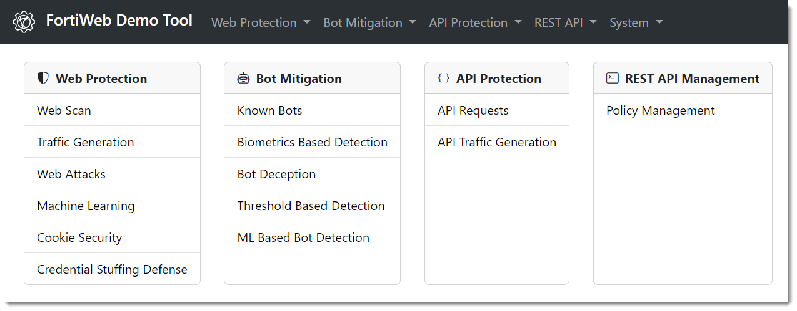

# Darwin2: A FortiWeb Demo Tool 🚀

Darwin2 is a demonstration tool designed to showcase the capabilities of FortiWeb and FortiWeb Cloud through a user-friendly graphical interface.



  - [Features](#features)
  - [Installation Guide](#installation-guide)
    - [Option 1: Installation on Linux 🐧](#option-1-installation-on-linux-)
    - [Option 2: Installation with Docker 🐳](#option-2-installation-with-docker-)
    - [Script Options 🛠️](#script-options-)
  - [Accessing the Application](#accessing-the-application)
  - [Background jobs](#background-jobs)

## Features

### Web Protection 🛡

- **Web Vulnerability Scanner**: Simulate OWASP TOP 10 attacks and showcase FortiWeb's blocking techniques.
- **Traffic Generation**: Generate cyber attacks from various IPs to populate FortiWeb logs and dashboards.
- **Web Attacks**: Demonstrate "user track" by generating specific attacks with usernames in attack logs.
- **Machine Learning & Zero-Day Attacks**: Train FortiWeb's ML model with legitimate traffic and block zero-day attacks.
- **Cookie Security**: Test cookie manipulation for privilege escalation and demonstrate blocking capabilities.
- **Credential Stuffing Defense**: Utilize stolen account credentials to demonstrate blocking with our reputation database.

### Bot Mitigation 🤖

- **Known Bots**: Protect against malicious bots while ensuring critical traffic flow.
- **Biometrics-Based Detection**: Identify request origins using client events like mouse movements and keyboard activity.
- **Bot Deception**: Trap malicious bots with bot deception policies.
- **Threshold-Based Detection**: Differentiate between human and bot requests based on behavior.
- **Machine Learning Based Bot Detection**: Extract data via web scraping to train ML models for bot detection.

### API Protection 🔐

- **API Requests**: Use Petstore3 for demonstrating FortiWeb's handling of legitimate or malicious API requests.
- **API Traffic Generation**: Simulate API traffic to build ML models and demonstrate zero-day attack protection.

### REST API ⚙️

- **Quickly manage a speedtest application** using primary API tasks to verify application accessibility.

## Installation Guide

Darwin2 uses Go 1.26 for the backend and Vue 3 with Vite for the frontend. The `darwin2.sh` utility script facilitates the installation of all necessary components.

### Option 1: Installation on Linux 🐧

**Prerequisites**

The `darwin2.sh` script automatically installs all necessary components for the application to function correctly, including:

- ✅ Git
- ✅ Go
- ✅ Nikto
- ✅ Node.js 24 LTS
- ✅ Npm
- ✅ Bootstrap
- ✅ Bootstrap Icons

Clone the Darwin2 repository, navigate to the directory, run the installation script, and then run the application with the following commands:

```bash
git clone https://github.com/benoitbMTL/darwin2.git
cd darwin2
./darwin2.sh install
./darwin2.sh run
```

### Option 2: Installation with Docker 🐳

**Prerequisites**

✅ Docker : the `darwin2.sh` script automatically installs Docker if it's not already installed.

Clone the Darwin2 repository, navigate to the directory, and then run the Docker script with the following commands:

```bash
git clone https://github.com/benoitbMTL/darwin2.git
cd darwin2
./darwin2.sh docker
```

### Script Options 🛠️

The `darwin2.sh` script supports several options for managing the application:

- **run**: Build and serve the application.
- **build-go**: Rebuild `go/darwin2` without starting the application.
- **docker**: Manage Docker container for the application.
- **update**: Update the application from Git.
- **force**: Force build and serve the application.
- **install**: Install and initialize environment to run the application.
- **version**: Display installed dependency versions.
- **help**: Display help message with usage instructions.

### Frontend development

```bash
cd vue
npm ci
npm run dev
```

Use `npm run lint` to check the Vue source and `npm run build` to create the production bundle.

## Background jobs

Long-running ML traffic generation, Nikto scans, Selenium sessions, and grouped FortiWeb object operations run as background jobs. The UI shows live progress, throughput, elapsed time, partial errors, cancellation, final output, and recent history.

The backend keeps the 100 most recent jobs in memory and runs at most four jobs concurrently. History is reset when Darwin2 restarts.

```text
POST   /jobs/start/:operation  Start a job and return HTTP 202 with its ID
GET    /jobs?type=&limit=      List recent jobs
GET    /jobs/:id               Read progress and results
DELETE /jobs/:id               Request cancellation
```

Supported operations are `machine-learning`, `api-traffic-generation`, `web-scan`, `traffic-generation`, `selenium`, `fortiweb-create`, and `fortiweb-delete`. The original synchronous endpoints remain available for compatibility.

## Accessing the Application

⚠️ After successfully installing the demo tool, you can access it by navigating to `http://<Machine IP>:8080` in your web browser. Before using the application, ensure that you have configured your applications by going to `System > Configuration` in the menu. This step is crucial for the proper operation of the demo tool.
